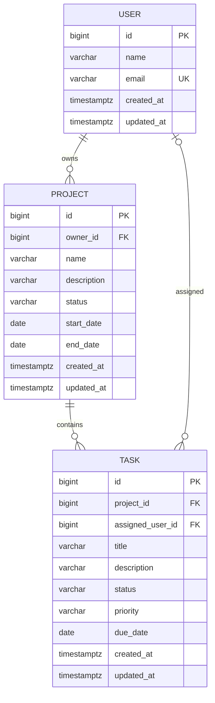

# Database Model

PostgreSQL is the relational store. Physical table and column names use `snake_case`; API JSON uses `camelCase`. The model is implemented as the initial Flyway migration at `src/main/resources/db/migration/V1__create_taskflow_schema.sql`. That migration creates the tables, foreign keys, checks, indexes, and `updated_at` triggers documented below. The three tables are now mapped by their corresponding JPA entities.

## Entities

### `users`

| Field | PostgreSQL type | Required | Default | Constraints and indexes |
| --- | --- | --- | --- | --- |
| `id` | `BIGINT` | Yes | generated identity | Primary key |
| `name` | `VARCHAR(100)` | Yes | — | Nonblank after trimming |
| `email` | `VARCHAR(254)` | Yes | — | Unique case-insensitively using a unique index on `LOWER(email)`; valid email enforced at API boundary |
| `created_at` | `TIMESTAMPTZ` | Yes | current UTC timestamp | — |
| `updated_at` | `TIMESTAMPTZ` | Yes | current UTC timestamp | — |

### `projects`

| Field | PostgreSQL type | Required | Default | Constraints and indexes |
| --- | --- | --- | --- | --- |
| `id` | `BIGINT` | Yes | generated identity | Primary key |
| `name` | `VARCHAR(150)` | Yes | — | Nonblank after trimming |
| `description` | `VARCHAR(4000)` | No | `NULL` | — |
| `status` | `VARCHAR(20)` | Yes | `ACTIVE` | Check: `ACTIVE` or `ARCHIVED`; index for status-based future queries not required in MVP |
| `owner_id` | `BIGINT` | Yes | — | Foreign key to `users(id)`; indexed |
| `start_date` | `DATE` | No | `NULL` | Check with `end_date`: start is not after end |
| `end_date` | `DATE` | No | `NULL` | Check with `start_date`: end is not before start |
| `created_at` | `TIMESTAMPTZ` | Yes | current UTC timestamp | — |
| `updated_at` | `TIMESTAMPTZ` | Yes | current UTC timestamp | — |

### `tasks`

| Field | PostgreSQL type | Required | Default | Constraints and indexes |
| --- | --- | --- | --- | --- |
| `id` | `BIGINT` | Yes | generated identity | Primary key |
| `project_id` | `BIGINT` | Yes | — | Foreign key to `projects(id)`; indexed |
| `title` | `VARCHAR(200)` | Yes | — | Nonblank after trimming |
| `description` | `VARCHAR(4000)` | No | `NULL` | — |
| `status` | `VARCHAR(20)` | Yes | `TODO` | Check: `TODO`, `IN_PROGRESS`, `DONE`; indexed with `project_id` |
| `priority` | `VARCHAR(10)` | Yes | `MEDIUM` | Check: `LOW`, `MEDIUM`, `HIGH`; indexed |
| `assigned_user_id` | `BIGINT` | No | `NULL` | Foreign key to `users(id)`; indexed |
| `due_date` | `DATE` | No | `NULL` | Indexed for due-date filter |
| `created_at` | `TIMESTAMPTZ` | Yes | current UTC timestamp | — |
| `updated_at` | `TIMESTAMPTZ` | Yes | current UTC timestamp | — |

Recommended composite index: `(project_id, status)` on `tasks`, because filtering a project's tasks by state is a likely common query. The independent `priority`, `assigned_user_id`, and `due_date` indexes directly support specified task filters. Indexes should be revisited with actual query plans after implementation.

## Relationships and deletion behavior

| Relationship | Owner (foreign key) | Cardinality | On deletion |
| --- | --- | --- | --- |
| User to Project | `projects.owner_id` | One user owns many projects; every project has one owner | Restrict user deletion while projects exist. |
| Project to Task | `tasks.project_id` | One project contains many tasks; every task has one project | Cascade project deletion to its tasks. |
| User to Task | `tasks.assigned_user_id` | One user may be assigned many tasks; a task has zero or one assignee | Restrict user deletion while assignments exist. |

## ERD

